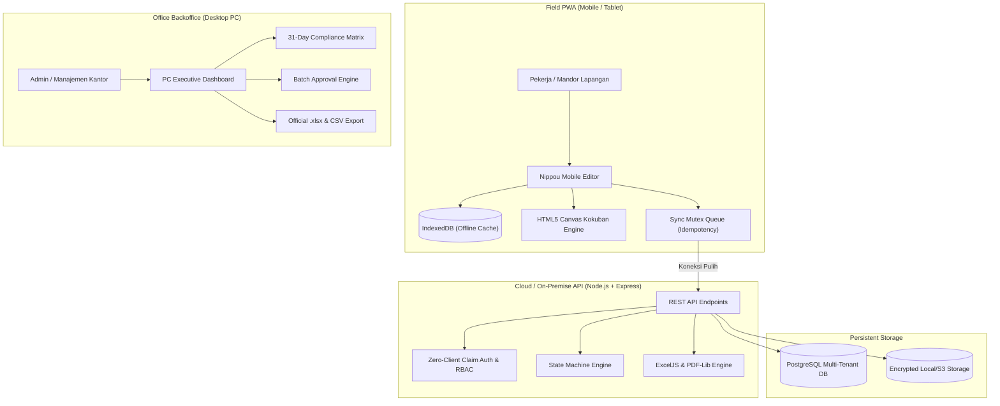

# DobokuTracker (土木トラッカー)
## Enterprise Field Operations & Civil Engineering Resource Governance SaaS


-0F766E?style=for-the-badge)


-8B5CF6?style=for-the-badge)

> **DobokuTracker** adalah platform *dual-interface* (Mobile PWA Lapangan + Desktop PC Backoffice) berstandar industri Jepang untuk operasional teknik sipil, pekerjaan tanah (*earthworks/土工*), dan pemindahan tanah sisa (*zando/残土運搬*). 
> 
> Dirancang untuk memecahkan krisis regulasi lembur ketat sektor konstruksi Jepang (**2024年問題**), sistem ini menggantikan formulir kertas manual (*作業日報*) dengan alur kerja digital yang tahan kondisi tanpa sinyal (*offline-first*), patuh pada spesifikasi inspeksi **MLIT (国土交通省)**, dan mengotomatisasi rekapitulasi penggajian serta penagihan proyek.

---

## 🌟 Fitur Unggulan Komersial (Industrial Grade v1.5)

| Fitur | Standar Industri Jepang | Solusi Rekayasa | Dampak Nyata |
| :--- | :--- | :--- | :--- |
| 📋 **前日コピー機能**<br>*(Salin Laporan Kemarin)* | Mengeliminasi pengulangan input data harian yang 90% identik. | Algoritma *deep replication* mereplikasi daftar pekerja, armada alat, dan jenis pekerjaan dengan ID lokal bersih dan reset jam kerja standar. | Memangkas waktu input mandor di lapangan dari **3 menit menjadi 30 detik** per hari. |
| 🔴 **電子印鑑 / 3-Kotak ハンコ**<br>*(Digital Hanko Approval)* | Hierarki legalitas stempel merah berjenjang Jepang. | Komponen visual stempel merah vermilion (`#DC2626`) dengan kanji marga, tanggal inspeksi, rotasi dinamis, dan 3 kotak hierarki: **【担当・職長】**, **【現場代理人】**, **【所長・確認】**. | Memenuhi keabsahan hukum dan budaya persetujuan resmi kontraktor utama (*moto-uke*). |
| 🟩 **電子黒板 (Digital Kokuban)**<br>*(Papan Tulis Proyek Otomatis)* | Spesifikasi foto inspeksi konstruksi digital MLIT (*国土交通省*). | Engine Canvas HTML5 client-side menyematkan papan hijau berbingkai kayu langsung ke foto lapangan: 工事件名, 工種, 測点(STA), 施工状況, 施工会社印. | Menghilangkan beban membawa papan tulis kayu & tripod fisik ke area galian berlumpur. |
| 📅 **月次カレンダー表示**<br>*(Monthly Compliance Matrix)* | Audit kepatuhan 31 hari dalam 1 layar manajerial. | Grid matriks 31 hari interaktif di PC Backoffice dengan filter proyek dan indikator KPI kepatuhan (*Teishutsu-ritsu / 提出率*). | Mencegah keterlambatan penagihan termin akibat laporan bolong di akhir bulan. |
| ⚡ **一括承認機能**<br>*(Batch Multi-Select Approval)* | Efisiensi verifikasi akhir bulan oleh Site Manager. | Transaksi database atomik multi-laporan dengan penegakan otomatis *Separation of Duties* (laporan buatan sendiri otomatis diskip). | Menyetujui 30+ laporan bulanan dalam **1 kali klik**. |
| 📗 **Excel Resmi & CSV BOM**<br>*(Corporate Export Engine)* | Standar format laporan korporat & ERP payroll. | Pembuatan berkas Excel murni (.xlsx via `ExcelJS`) bertema warna teal, garis bawah ganda akuntansi Jepang, formula total otomatis, dan CSV UTF-8 BOM bebas *mojibake*. | Menghemat 2–3 hari kerja staf kantor di setiap akhir bulan penutupan buku. |

---

## 🏗️ Arsitektur Sistem & Rekayasa Teknis



### 1. Offline-First & Concurrency Control
* **IndexedDB Local Storage**: Draft dan mutasi data dicatat ke penyimpanan peramban lokal sebelum transmisi jaringan.
* **Optimistic Concurrency Control**: Setiap dokumen dilengkapi kolom `version`. Permintaan bersamaan dengan versi basi ditolak dengan HTTP `409 Conflict`, memicu modal resolusi visual tanpa membuang input mandor.
* **Idempotency Antrean**: *Header* `X-Idempotency-Key` menjamin tidak ada duplikasi data akibat *retry* otomatis di area bersinyal lemah.

### 2. Multi-Tenant Security & Separation of Duties
* **Zero-Client Claim Trust**: Token otentikasi diverifikasi pada setiap *request*; hak akses proyek diambil langsung dari database secara real-time.
* **Separation of Duties**: Sistem menolak persetujuan laporan yang dibuat oleh pelapor itu sendiri demi mencegah konflik kepentingan dan manipulasi absensi.
* **Immutabilitas Laporan**: Laporan `APPROVED` terkunci secara permanen. Koreksi pasca-persetujuan diwajibkan melalui pembuatan revisi baru ber-snapshot.

---

## 🛠️ Tech Stack

* **Frontend**: React 18, TypeScript, Tailwind CSS, Vite, `idb` (IndexedDB), Lucide Icons
* **Backend**: Node.js, Express, TypeScript (Modular Monolith)
* **Database**: PostgreSQL relasional terkelola (Supabase Tokyo `ap-northeast-1` / embedded PGlite WebAssembly untuk dev cepat)
* **Dokumen & Media**: `exceljs` (Excel bergaya korporat), `pdf-lib` (Cetak A4 Hanko), HTML5 Canvas (Kokuban)
* **Testing & Kualitas**: Vitest (31 automated unit/integration tests)

---

## 🧪 Bukti Pengujian Otomatis (Test Suite)

Seluruh test suite backend lulus 100%:

```text
✓ tests/isolation.test.ts (4 tests) - Isolasi tenant multi-organisasi & RBAC proyek
✓ tests/concurrency.test.ts (4 tests) - Konflik 409 & antrean idempotensi
✓ tests/master.test.ts (7 tests) - Kelola master data pekerja, armada, proteksi role
✓ tests/analytics.test.ts (5 tests) - KPI dashboard, CSV BOM, ExcelJS .xlsx
✓ tests/workflow.test.ts (11 tests) - Workflow status, Batch Approve, Kalender, Copy Previous

Test Files  5 passed (5)
     Tests  31 passed (31)
  Duration  25.41s
```

Frontend Production Build:
```text
✓ 1596 modules transformed.
dist/index.html                   0.65 kB │ gzip:  0.44 kB
dist/assets/index-DFXllbJB.css   36.04 kB │ gzip:  6.54 kB
dist/assets/index-CNbviToY.js   316.43 kB │ gzip: 87.04 kB
✓ built in 3.71s (0 errors, 0 warnings)
```

---

## 🚀 Panduan Menjalankan Secara Lokal

### Prasyarat:
* Node.js v18+ dan npm

### 1. Backend:
```bash
cd backend
npm install
npm run dev
# Backend berjalan di http://localhost:4000
```

### 2. Frontend:
```bash
cd frontend
npm install
npm run dev
# Frontend terbuka di http://localhost:5173
```

### 3. Opsi Docker Compose (Full PostgreSQL Stack)
Jika Docker Desktop telah aktif:
```bash
docker compose up --build
```
- Frontend: `http://localhost:5173`
- Backend API: `http://localhost:4000`
- PostgreSQL: `localhost:5432` (db: `dobokutracker`, user: `doboku_user`)

---

## 👥 Akun Demo Bawaan

| Akun | ID Pengguna | Peran | Akses Tampilan |
| :--- | :--- | :--- | :--- |
| **山田 太郎** | `usr-admin` | Admin / Manajemen Kantor | Otomatis membuka **PC Backoffice Executive Dashboard** (Matriks Kalender, Batch Approve, Master Data) |
| **佐藤 健一** | `usr-foreman` | Mandor / Site Supervisor | Antrean Review, Approval berjenjang, dan Inspeksi |
| **田中 一郎** | `usr-worker-1` | Pekerja Lapangan (*Sagyouin*) | Tampilan **Mobile PWA** (Form Nippou, Digital Kokuban, Salin Kemarin) |

---

## 📄 Lisensi & Hak Cipta
Dirancang dan dikembangkan sebagai solusi perangkat lunak enterprise B2B SaaS untuk kontraktor teknik sipil & pekerjaan tanah di Tokyo (Confidential Client). Hak cipta dilindungi undang-undang.

